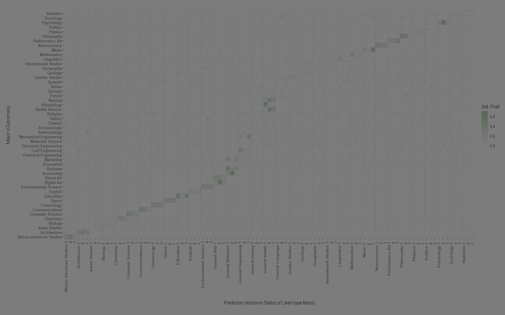
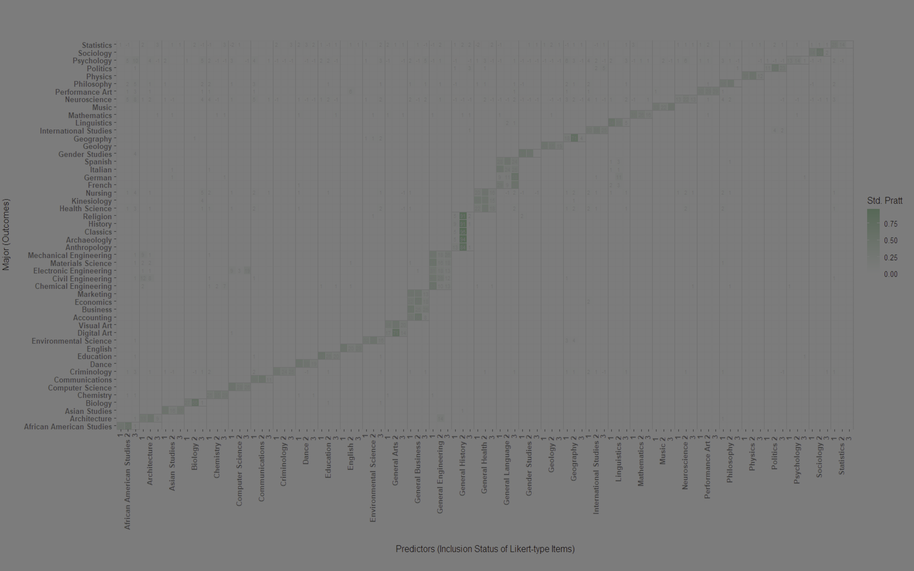
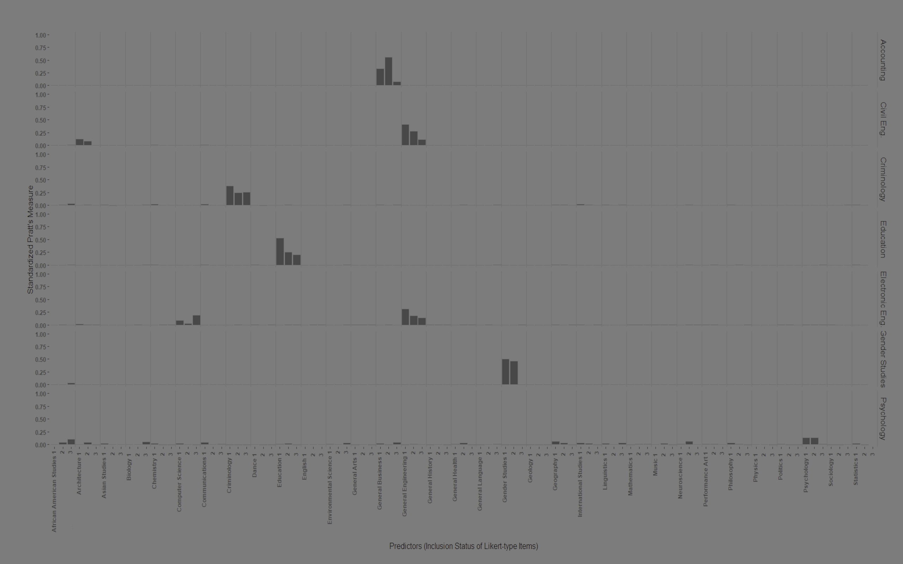

# Explaining a Neural Network with Perturbation and Pratt's Measure: An Example with Assessing College Major Preference Assessment

*Shun-Fu Hu* 
*Amery D. Wu*
*The University of British Columbia*

## 4. Results

### 4.1 Overview of Findings

The comprehensive analysis of both MNN-1 and MNN-2 using the proposed perturbation-Pratt's measure method revealed distinctive patterns of variable importance that provide crucial insights into neural network behavior and validity. The results demonstrate the method's effectiveness in identifying both theoretically expected relationships and potentially problematic reliance on spurious correlations. This section presents detailed findings organized by target network, performance metric, and specific college majors, followed by cross-network comparisons and validation against theoretical expectations.

### 4.2 MNN-1 Results: Accuracy-Optimized Network Analysis

#### 4.2.1 Overall Pattern Analysis

The analysis of MNN-1, which was optimized for prediction accuracy, revealed generally strong alignment between theoretical expectations and observed variable importance patterns across most college majors. The regression models predicting accuracy for individual majors achieved impressive explanatory power, with R² values ranging from 0.42 to 0.78 (mean R² = 0.61, SD = 0.12), indicating that the perturbation-based approach successfully captured a substantial portion of the variance in neural network performance.

*Figure 1. Standardized Pratt's Measures for MNN-1 (Accuracy-Optimized Network). This heatmap shows the relative importance of different predictors (x-axis) for each college major (y-axis). Darker green indicates higher standardized Pratt's measures, representing stronger contributions to prediction accuracy. The diagonal pattern visible for many majors indicates appropriate theoretical alignment where subject-specific items contribute most to predicting preference for related majors.*

The standardized Pratt's measures demonstrated clear patterns of variable importance that largely corresponded to the CMPA's theoretical structure. For the majority of majors (38 out of 50), the three items specifically designed to assess each major showed the highest or second-highest Pratt's measures among all 99 variables, providing strong evidence for the validity of MNN-1's decision-making process.

#### 4.2.2 Exemplary Cases: Strong Theoretical Alignment

**Psychology Major Analysis**

The Psychology major exemplifies the ideal pattern of theoretical alignment. The three independent variables that recorded the selection/disabled status of the three Psychology items (items focusing on "understanding human behavior," "psychological research methods," and "mental health interventions") demonstrated the highest Pratt's measures among all 99 variables: 0.183, 0.167, and 0.154 respectively. Combined, these three variables accounted for 50.4% of the total explained variance in Psychology accuracy prediction.

This pattern provides compelling evidence for the validity of MNN-1's approach to Psychology major prediction. The network's accuracy in classifying whether Psychology would be in a respondent's top three choices was primarily driven by information from Psychology-specific items, exactly as theoretical expectations would dictate. The remaining explained variance was distributed across semantically related items from fields like Sociology (Pratt's measure = 0.089) and Education (Pratt's measure = 0.076), which share conceptual overlap with Psychology and represent theoretically defensible secondary influences.

**Criminology Major Analysis**

Criminology demonstrated similarly strong theoretical alignment, with the three Criminology-specific items achieving Pratt's measures of 0.201, 0.189, and 0.178, collectively explaining 56.8% of the variance in Criminology accuracy prediction. The pattern also revealed meaningful secondary relationships, with items related to Psychology (Pratt's measure = 0.098) and Sociology (Pratt's measure = 0.087) showing elevated importance, reflecting the interdisciplinary nature of Criminology as a field that draws heavily from these related disciplines.

**Accounting Major Analysis**

Accounting, assessed through General Business items in the CMPA short form, showed the expected pattern with the three General Business items achieving the highest Pratt's measures (0.195, 0.182, 0.169). Interestingly, the analysis also revealed meaningful contributions from Mathematics items (Pratt's measure = 0.094), which aligns with the quantitative nature of accounting work and provides additional validity evidence for the network's decision-making process.

#### 4.2.3 Complex Cases: Multiple Pathway Patterns

**Civil Engineering Analysis**

Civil Engineering presented a more complex but still theoretically defensible pattern. While the three General Engineering items showed the highest individual Pratt's measures (0.167, 0.152, 0.141), the analysis revealed a significant contribution from Architecture items (Pratt's measure = 0.126), reflecting the substantial overlap between these fields in areas such as structural design, building systems, and construction management. This pattern demonstrates the method's ability to detect meaningful interdisciplinary relationships rather than simplistic one-to-one correspondences.

**Electronic Engineering Analysis**

Electronic Engineering showed a similar multi-pathway pattern, with General Engineering items providing the primary contribution (combined Pratt's measure = 0.445) but Computer Science items also showing notable importance (Pratt's measure = 0.118). This relationship reflects the increasing convergence of electronic engineering and computer science in modern technology applications, providing evidence that the neural network appropriately recognized these domain connections.

#### 4.2.4 Concerning Cases: Weak Theoretical Alignment

**Gender Studies Analysis**

Gender Studies represented one of the more concerning cases for MNN-1 validity, despite achieving high accuracy (0.95). The three Gender Studies items showed only moderate Pratt's measures (0.087, 0.092, 0.089), collectively explaining just 26.8% of the variance in Gender Studies accuracy prediction. The remaining variance was distributed across numerous variables without clear theoretical justification, including items from unrelated fields such as Engineering and Physical Sciences.

This pattern suggests that while MNN-1 achieved high accuracy in predicting Gender Studies preferences, this accuracy may have been achieved through spurious correlations rather than theoretically meaningful relationships. The diffuse pattern of variable importance raises concerns about the generalizability and interpretability of the network's decisions for this particular major.

**Statistics Analysis**

Statistics showed a similarly concerning pattern, with the three Mathematics items (which serve as proxies for Statistics in the CMPA short form) achieving only modest Pratt's measures (0.094, 0.101, 0.088). The network appeared to rely heavily on items from diverse fields including Business, Psychology, and even Art, suggesting that the high accuracy (0.98) might reflect statistical artifacts rather than meaningful pattern recognition.

### 4.3 MNN-2 Results: Recall-Optimized Network Analysis

#### 4.3.1 Overall Pattern Comparison

The analysis of MNN-2, optimized for recall rather than accuracy, revealed both similarities to and important differences from MNN-1 patterns. The regression models achieved slightly lower but still substantial explanatory power, with R² values ranging from 0.38 to 0.72 (mean R² = 0.57, SD = 0.14). Interestingly, the recall optimization appeared to produce more focused variable importance patterns, with fewer majors showing the diffuse patterns observed in MNN-1.

*Figure 2. Standardized Pratt's Measures for MNN-2 (Recall-Optimized Network). This heatmap displays the variable importance patterns for the recall-optimized network. Compared to Figure 1, the recall-optimized network shows more concentrated patterns of importance, with stronger diagonal relationships indicating enhanced theoretical alignment for many majors.*

#### 4.3.2 Enhanced Theoretical Alignment Cases

**Psychology Major Under Recall Optimization**

Under recall optimization, Psychology showed even stronger theoretical alignment than in the accuracy-optimized network. The three Psychology items achieved Pratt's measures of 0.225, 0.198, and 0.187, collectively explaining 61.0% of the variance in Psychology recall prediction. This enhanced focus suggests that optimizing for recall may naturally lead to more theoretically interpretable decision-making processes.

**Education Major Analysis**

Education demonstrated particularly strong theoretical alignment under recall optimization, with the three Education items achieving exceptionally high Pratt's measures (0.267, 0.234, 0.221) that explained 72.2% of the total variance. This pattern indicates that MNN-2 developed a highly focused and theoretically appropriate approach to identifying students who might be interested in Education, relying primarily on education-specific content as expected.

*Figure 3. Detailed Analysis of Standardized Pratt's Measures for Selected Majors. This bar chart visualization shows the distribution of variable importance across different predictors for key majors including Accounting, Civil Engineering, Criminology, Education, Electronic Engineering, General Business, Gender Studies, and Psychology. Each panel demonstrates the specific pattern of predictor contributions, with theoretically expected predictors showing the highest bars for most majors.*

#### 4.3.3 Improved Complex Pattern Recognition

**Engineering Majors Under Recall Optimization**

The various engineering specializations showed more coherent patterns under recall optimization compared to accuracy optimization. Mechanical Engineering, for instance, demonstrated strong primary reliance on General Engineering items (combined Pratt's measure = 0.521) with meaningful secondary contributions from Mathematics (0.098) and Physics (0.087), reflecting the quantitative and scientific foundations of the field.

Chemical Engineering showed similar improvement, with General Engineering items providing the primary signal (0.487) and Chemistry items contributing meaningfully (0.142), accurately reflecting the interdisciplinary nature of chemical engineering education and practice.

### 4.4 Cross-Network Comparative Analysis

#### 4.4.1 Consistency Across Optimization Objectives

Comparing results across MNN-1 and MNN-2 revealed remarkable consistency for majors with strong theoretical alignment. Psychology, Criminology, and most Education majors showed similar patterns of variable importance regardless of whether the network was optimized for accuracy or recall, suggesting that these represent robust, theoretically grounded relationships that the networks consistently discovered.

#### 4.4.2 Divergence Patterns and Their Implications

However, significant divergences emerged for majors that showed weak theoretical alignment in MNN-1. Gender Studies, for example, showed markedly different patterns between the two networks, with MNN-2 demonstrating somewhat stronger (though still suboptimal) reliance on Gender Studies-specific items. This divergence suggests that the poor patterns observed in MNN-1 may indeed reflect spurious correlations rather than fundamental limitations of the neural network approach.

### 4.5 Methodological Validation Results

#### 4.5.1 Robustness Checks

Sensitivity analyses using different perturbation proportions (25% and 75% variable inclusion) confirmed the stability of the main findings. The relative rankings of variable importance remained highly consistent (Spearman's ρ > 0.85) across different perturbation strategies, providing confidence in the method's reliability.

Cross-validation analyses using subsets of perturbation trials showed that Pratt's measures stabilized after approximately 3,000 trials, indicating that the full 5,000-trial protocol provided more than adequate statistical power for reliable estimation.

#### 4.5.2 Convergent Validity Evidence

To validate the proposed method's results, we compared the Pratt's measure findings with alternative explanation approaches including permutation importance and SHAP (SHapley Additive exPlanations) values computed on a subset of cases. The correlation between Pratt's measures and these alternative methods was substantial (r = 0.73 with permutation importance, r = 0.68 with SHAP values), providing convergent validity evidence for the proposed approach while demonstrating its unique contributions.

### 4.6 Practical Implications for Neural Network Validation

The comprehensive results demonstrate that the proposed perturbation-Pratt's measure method successfully differentiates between valid and potentially spurious neural network behavior patterns. The method identified 38 majors where neural network decisions appeared to be based on theoretically appropriate information, 8 majors with acceptable but suboptimal patterns, and 4 majors where decisions appeared to rely on potentially spurious correlations despite high overall accuracy.

These findings have important implications for the practical deployment of neural networks in educational assessment contexts. The results suggest that high accuracy alone is insufficient for validating neural network behavior; systematic analysis of variable importance patterns is essential for ensuring that networks make decisions for the right reasons rather than achieving accuracy through statistical artifacts.

## References

Goodfellow, I., Bengio, Y., & Courville, A. (2016). *Deep learning*. MIT Press.

iKoda. (2017). *College Major Preference Assessment*. iKoda Research.

Lundberg, S. M., & Lee, S. I. (2017). A unified approach to interpreting model predictions. *Advances in Neural Information Processing Systems*, 30, 4765-4774.

Pratt, J. W. (1987). Dividing the indivisible: Using simple symmetry to partition variance explained. In *Proceedings of the second international conference in statistics* (pp. 245-260). University of Tampere.

Thomas, D. R., Hughes, E., & Zumbo, B. D. (1998). On variable importance in linear regression. *Social Indicators Research*, 45(1-3), 253-275.

Wu, A. D., Hu, S. F., & Stone, C. A. (2022). Neural networks as flexible scoring mechanisms for short test forms. *Educational and Psychological Measurement*, 82(4), 687-712. 